# Project 3: AWS Cloud Setup for Web Application (Lift and Shift)

This project migrates the multi-tier Java web application from [Project 1](https://github.com/apotitech/DevOps_101_Projects/tree/main/PROJECT_1) to AWS using a Lift and Shift strategy. The goal is to move the existing local setup to cloud infrastructure with minimal changes to the application itself.

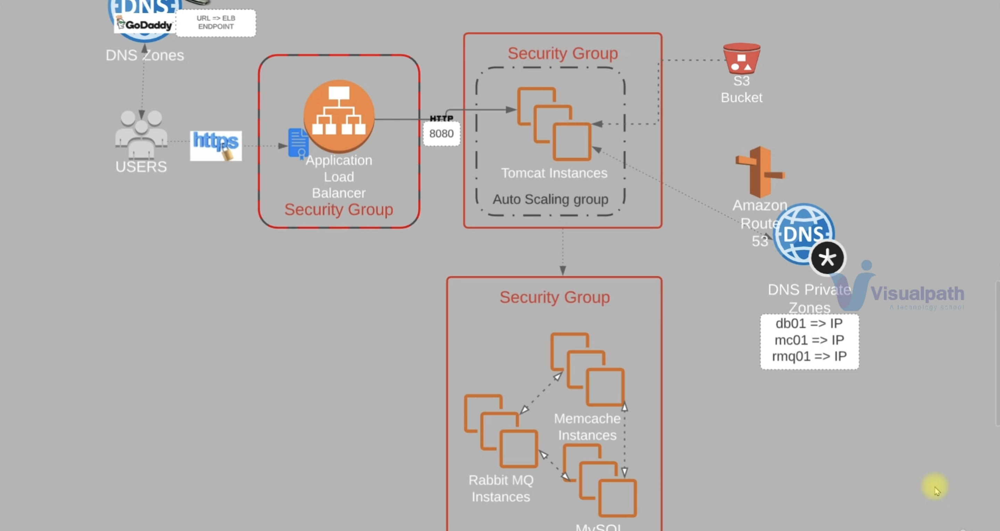

## AWS Services Used

| Service | Purpose |
|---------|---------|
| EC2 | Virtual machines for all application tiers |
| Elastic Load Balancer | Distributes traffic to Tomcat instances |
| Auto Scaling | Manages Tomcat instance scaling |
| S3 | Artifact storage |
| Amazon Certificate Manager | SSL/TLS certificate for HTTPS |
| Route 53 | Private DNS for backend service discovery |
| Security Groups | Network access control |

## Other Tools

- GoDaddy (domain and DNS)
- JDK 8
- Maven

---

## Step 1: SSL Certificate Setup

Log in to your AWS account and navigate to Amazon Certificate Manager. Create a certificate for your domain and validate it via GoDaddy to enable a secure HTTPS connection.

---

## Step 2: Security Groups

Navigate to EC2 and create three security groups.

**Load Balancer Security Group**
- Allow inbound HTTP (port 80) from all IPv4 and IPv6
- Allow inbound HTTPS (port 443) from all IPv4 and IPv6

**Tomcat App Security Group**
- Allow inbound port 8080 from the load balancer security group only

**Backend Services Security Group** (RabbitMQ, Memcached, MySQL)
- Allow port 3306 (MySQL) from the Tomcat security group
- Allow port 11211 (Memcached) from the Tomcat security group
- Allow port 5672 (RabbitMQ) from the Tomcat security group
- Allow all traffic from within the backend security group itself

Add inbound SSH (port 22) access to all three security groups for administration.

---

## Step 3: EC2 Instance Provisioning

Create a key pair to use across all EC2 instances.

Launch the following backend instances using CentOS 7, the shared key pair, and the backend security group. Pass each bash script as userdata during provisioning.

- MySQL: [mysql.sh](./userdata/mysql.sh)
- Memcached: [memcache.sh](./userdata/memcache.sh)
- RabbitMQ: [rabbitmq.sh](./userdata/rabbitmq.sh)

Verify all three instances are running in the EC2 console.

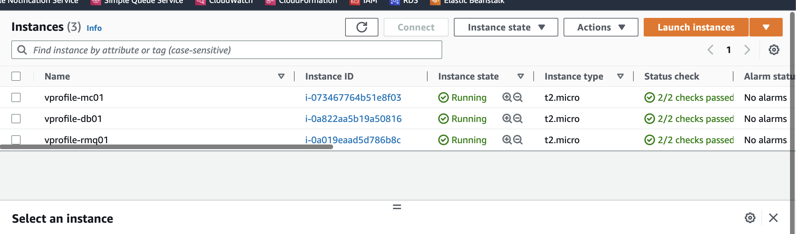

---

## Step 4: Route 53 Private DNS

Navigate to Route 53 and create a private hosted zone. Add a DNS record for each backend instance using its private IP address. These hostnames are what the Tomcat application uses to reach each service.

| Record | Points To |
|--------|-----------|
| db01.vprofile.in | MySQL private IP |
| rmq01.vprofile.in | RabbitMQ private IP |
| mc01.vprofile.in | Memcached private IP |

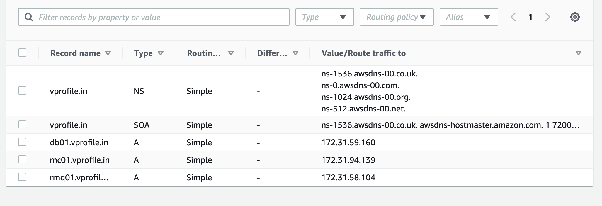

---

## Step 5: Tomcat Instance

Launch an Ubuntu 18 instance for the application server using [tomcat_ubuntu.sh](./userdata/tomcat_ubuntu.sh) as the userdata. Use the same key pair and the Tomcat app security group.

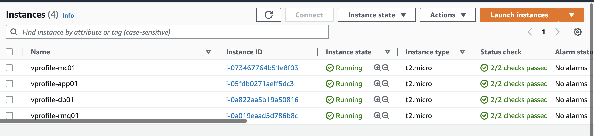

---

## Step 6: Build the Artifact

Update `src/main/resources/application.properties` with the Route 53 CNAMEs from Step 4:

```properties
jdbc.url=jdbc:mysql://db01.vprofile.in:3306/accounts
rabbitmq.address=rmq01.vprofile.in
memcached.active.host=mc01.vprofile.in
```

Build the artifact from the project root:

```bash
mvn install
```

A successful build produces a `.war` file in the `target` directory.

---

## Step 7: Deploy Artifact via S3

Create an IAM user with S3 full access and configure the AWS CLI with those credentials. Create an S3 bucket and upload the artifact:

```bash
aws s3 mb s3://vprofile-artifact-storage1234
aws s3 cp vprofile-v2.war s3://vprofile-artifact-storage1234/vprofile-v2.war
```

Create an IAM role with S3 full access and attach it to the Tomcat EC2 instance. Then SSH into the app server and deploy:

```bash
sudo -i
systemctl status tomcat8
cd /var/lib/tomcat8/webapps
rm -rf ROOT/
apt install awscli -y
aws s3 ls vprofile-artifact-storage1234
aws s3 cp s3://vprofile-artifact-storage1234/vprofile-v2.war /tmp/vprofile-v2.war
cd /tmp/
cp vprofile-v2.war /var/lib/tomcat8/webapps/ROOT.war
systemctl start tomcat8
```

---

## Step 8: Load Balancer and Validation

Create a target group pointing to the Tomcat instance, then set up an Application Load Balancer using that target group. Copy the load balancer URL to your GoDaddy DNS as a CNAME record.

Open `http://vprofileapp.barrydevops.com` in your browser to validate the full stack.

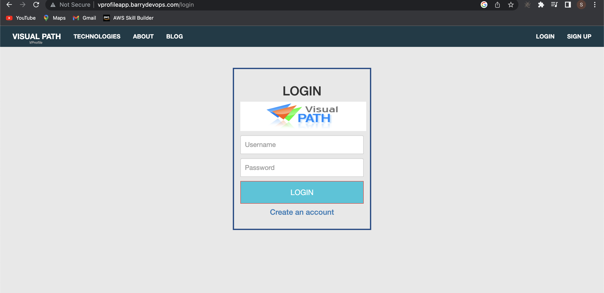

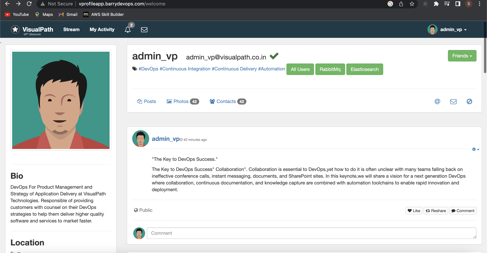

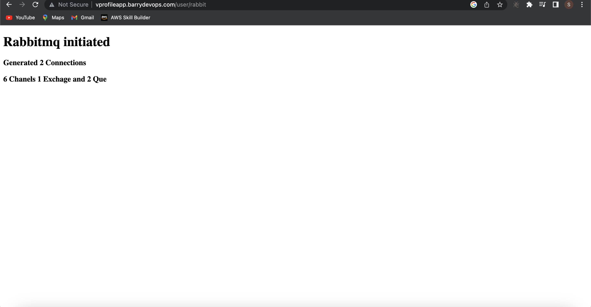

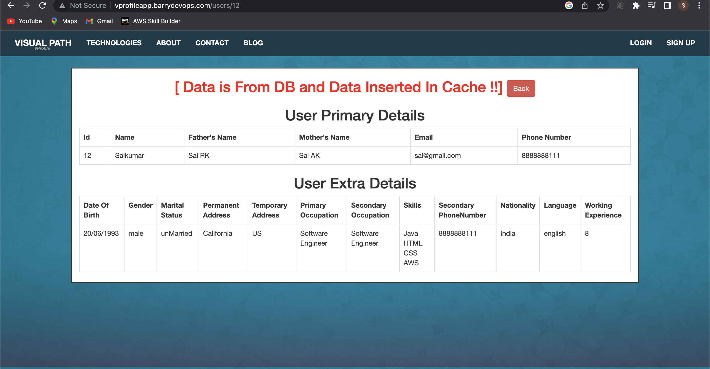

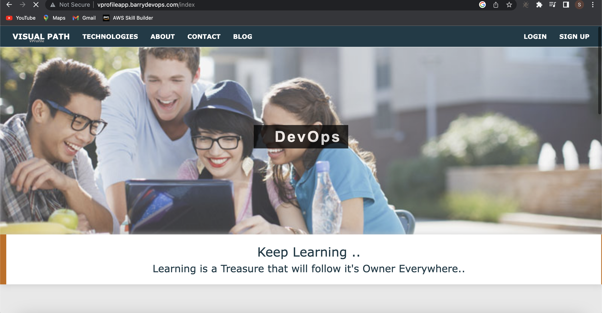

---

## Step 9: Auto Scaling

Create an AMI from the running Tomcat instance to use as a blueprint for scaling. Use that AMI to create a launch configuration, then set up an EC2 Auto Scaling group.

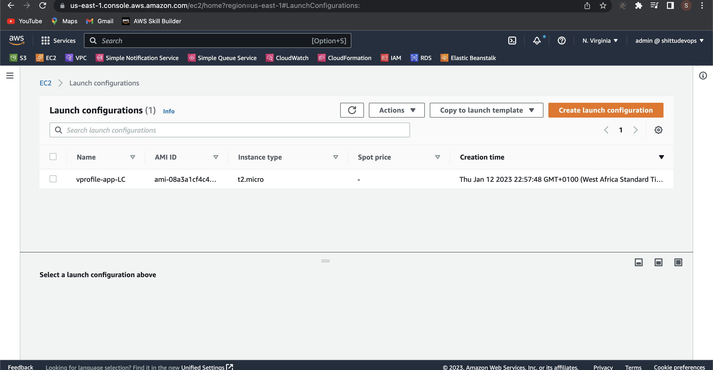

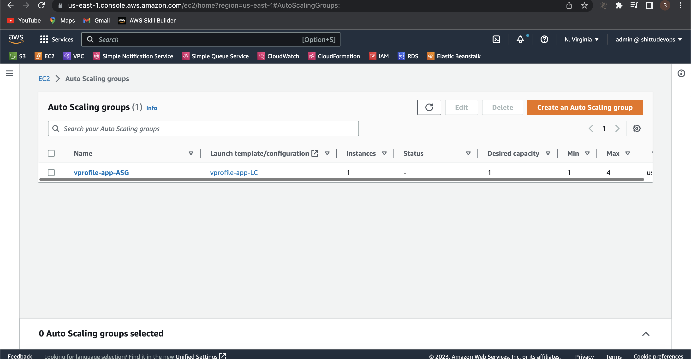

---

## Cleanup

Delete all running instances, the load balancer, target group, auto scaling group, and S3 bucket after validating to avoid ongoing costs.
